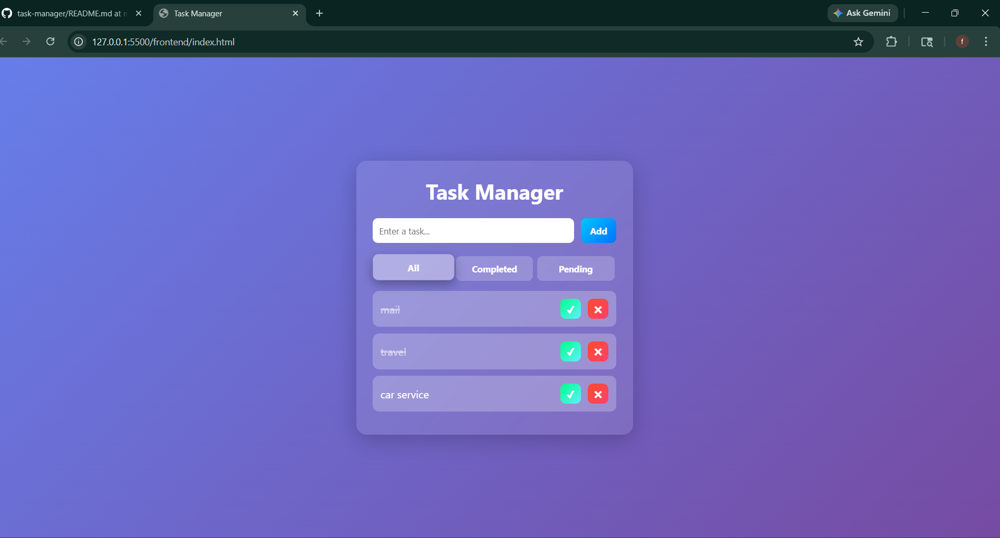

# Task Manager Full Stack Application
## Preview

## Overview
This project is a simple and efficient Task Manager application built as part of a full stack development assignment. It allows users to create, view, update, and delete tasks using a clean frontend interface and a RESTful backend API.

The goal of this project is to demonstrate core full stack development skills including frontend UI handling, backend API design, and data persistence.

---

## Features

### Core Features
- Add new tasks  
- View all tasks  
- Mark tasks as completed  
- Delete tasks  
- Real-time UI updates  
- Basic loading and error handling
- Includes bonus features like task filtering, editing, and persistent storage.

### Bonus Features
- Filter tasks by:
  - All
  - Completed
  - Pending  
- Edit task title (double-click to edit)  
- Persistent storage using file system (tasks.json)  

---

## Tech Stack

### Frontend
- HTML  
- CSS (modern UI with animations)  
- JavaScript (Vanilla JS)  

### Backend
- Node.js  
- Express.js  

### Storage
- File-based storage using JSON (tasks.json)  

---

## Project Structure

task-manager/
├── frontend/
│   ├── index.html
│   ├── style.css
│   └── script.js
│
├── backend/
│   ├── server.js
│   ├── tasks.json
│   ├── package.json
│   └── node_modules/
│
├── .gitignore
└── README.md

---

## API Endpoints

GET    /tasks         → Fetch all tasks  
POST   /tasks         → Create a new task  
PATCH  /tasks/:id     → Update task (toggle/edit title)  
DELETE /tasks/:id     → Delete a task  

---

## How to Run the Project

1. Clone the repository
git clone https://github.com/faraz1726/task-manager
cd task-manager

2. Start the backend server
cd backend
npm install
node server.js

Server runs on:
http://localhost:5000

3. Run the frontend
Open frontend/index.html in your browser  

---

## Key Highlights
- Clean separation of frontend and backend  
- RESTful API implementation  
- Basic validation and error handling  
- Persistent storage without a database  
- Simple and intuitive UI  

---

## Notes
- Data is stored in tasks.json  
- No external database is used  
- Data persists even after server restart  

---

## Future Improvements
- Add authentication (login/signup)  
- Use database (MongoDB / MySQL)  
- Deploy application online  
- Add testing (unit/integration)  

---

## Author
FARAZ AHMED QURESHI
farazahmedq15@gmail.com
+91 9650558676
Developed as part of a Full Stack Developer assignment.
